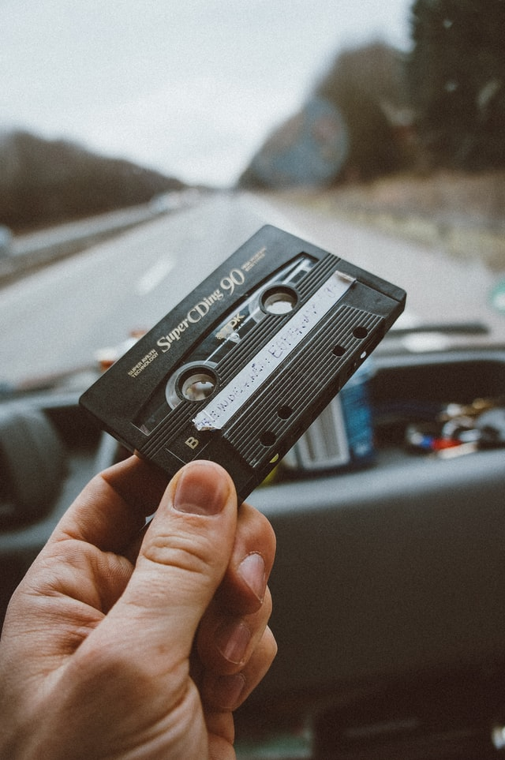

<h1>Good Life Music Mixer!</h1>
Music is something that we all enjoy in the course of our lives. It is the sound brought together by a variety of instruments and/or voices harmonizing together. 
There are those who appreciate music and those who create them through instruments - percussion, string, brass and woodwind.
You don't necessarily need to understand to enjoy music, it is a universal language.
SO, Drag and drop different sound samples to make your own musical beat of the day! Select a variety of tracks to start the day!

<h2>Assisted:</h2>
<ul>
<li>Eugene Na @Gene3829</li>
</ul>

-----------------------------------------------------------
<h2>Built with:</h2>
<ul>
<li>Basic css and html: flexbox layout and simple CSS3 animation and transitions</li>
<li>Javascript for drag and drop functions accompanied with play selected audio function.</li>
<li>Includes svg icons and images created from Adobe Illustrator 2021 and unsplash (stock image)</li>
</ul>
